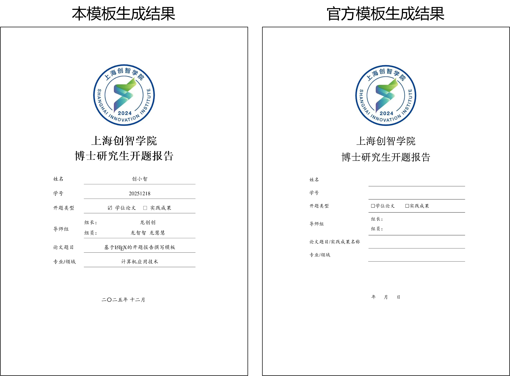

# 上海创智学院博士生开题报告模板

本项目基于北大学位论文模板[pkuthss](https://github.com/CasperVector/pkuthss) v1.8.3进行了针对封面内容的修改，使其适用于上海创智学院博士生开题报告。其封面细节与上海创智学院官方提供的Word版模板略有出入，但是有效性得到了老师的认可。

`main.tex`里提供了名为`type`的设置项，可以选择`thesis`（学位论文）或`practice`（实践成果），会影响封面上的方框打钩和文字内容。

编译结果与Word版模板的对比如下图所示。

